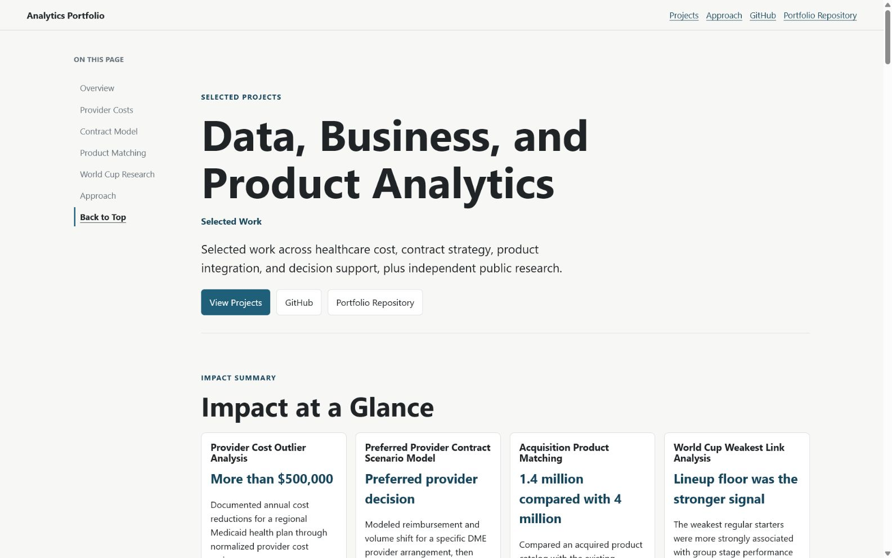

# Analytics Portfolio

Live portfolio: https://belmirsmajic.github.io/portfolio/

Data, business, and product analytics across healthcare cost, contract strategy, product integration, real estate risk, and decision support.



## Projects

1. Provider Cost Outlier Analysis
   Normalized provider cost within peer groups to identify actionable outliers and support more than $500,000 in documented annual reductions for a regional Medicaid health plan.

2. Preferred Provider Contract Scenario Model
   Modeled reimbursement and volume shift for a specific DME provider arrangement, then compared projected savings with actual performance.

3. Acquisition Product Matching
   Compared approximately 1.4 million acquired products with roughly 4 million existing products while saving hundreds of manual work hours.

4. Hurricane Exposure and Portfolio Risk Analysis
   Mapped potential hurricane exposure across a state pension fund real estate portfolio to identify affected properties, estimate exposed value, and support leadership and board reporting.

5. World Cup Weakest Link Analysis
   Independent public research testing whether lineup floor was more informative about group stage performance and advancement than total value or star power.

## Data Note

Professional project visuals use synthetic data created to demonstrate the original analytical workflows. No employer, member, provider, contract, supplier, property, or product data is displayed. The World Cup analysis uses public data and links to its full public analysis.

## Technology

The site is a static portfolio built with HTML, CSS, JavaScript, a local JSON data bundle, and a small Python validation script. GitHub Actions validates the site and publishes the static files to GitHub Pages.

## Repository Structure

```text
.
|-- index.html                  Main page content and project sections
|-- styles.css                  Visual system, responsive layout, and navigation styles
|-- app.js                      Interactive visuals, section navigation, and dialogs
|-- assets/portfolio-data.json  Public data bundle for portfolio visuals
|-- assets/homepage-screenshot.jpg
|-- scripts/validate_site.py    Local validation checks
`-- .github/workflows/pages.yml
```

## Local Validation

```powershell
python scripts/validate_site.py
python -m http.server 8767 --directory .
```

Open `http://localhost:8767/` to preview the portfolio locally.

## Deployment

GitHub Actions runs the validation script and publishes the static site to the `gh-pages` branch for GitHub Pages.
